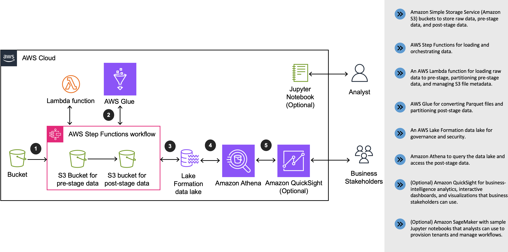
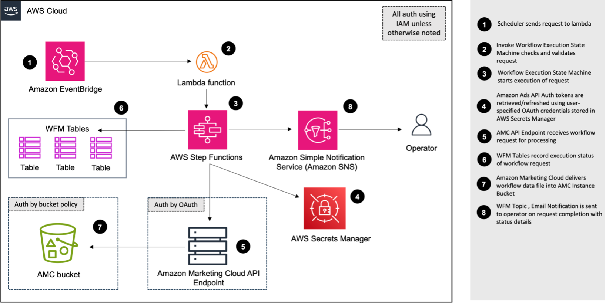

# Amazon Marketing Cloud Insights on AWS

Amazon Marketing Cloud Insights on AWS

## Architecture

The following images show the architecture of the solution and its components 


*Overview*


*Workflow Manager* 


*Data Lake*

**Note**: From v2.0.0, AWS CloudFormation template resources are created by the [AWS CDK](https://aws.amazon.com/cdk/)
and [AWS Solutions Constructs](https://aws.amazon.com/solutions/constructs/).

### AWS CDK Constructs

[AWS CDK Solutions Constructs](https://aws.amazon.com/solutions/constructs/) make it easier to consistently create
well-architected applications. All AWS Solutions Constructs are reviewed by AWS and use best practices established by
the AWS Well-Architected Framework.

---

### AWS Service Requirements

* [Amazon Sagemaker Notebook Instance](https://aws.amazon.com/sagemaker/notebooks/)
* [AWS Key Management Service (KMS)](https://aws.amazon.com/kms/)
* [Amazon S3](https://aws.amazon.com/s3/)
* [Amazon CloudWatch](https://aws.amazon.com/cloudwatch/)
* [AWS Lambda](https://aws.amazon.com/lambda/)
* [Amazon DynamoDB](https://aws.amazon.com/dynamodb/)
* [AWS Identity and Access Management (IAM)](https://aws.amazon.com/iam/)
* [AWS Step Functions](https://aws.amazon.com/step-functions/)
* [Amazon Simple Queue Service (SQS)](https://aws.amazon.com/sqs/)
* [Amazon Simple Notification Service (SNS)](https://aws.amazon.com/sns/)
* [AWS CloudFormation](https://aws.amazon.com/cloudformation/)
* [AWS Glue](https://aws.amazon.com/glue/)
* [AWS Lake Formation](https://aws.amazon.com/lake-formation/)
* [Amazon EventBridge](https://aws.amazon.com/eventbridge/)
* [AWS CloudTrail](https://aws.amazon.com/cloudtrail/)
* [AWS Service Catalog](https://aws.amazon.com/servicecatalog/)
* [AWS Systems Manager](https://aws.amazon.com/systems-manager/)

---

### IAM Roles for Installation and Operation

The IAM policies required to install the solution are listed within
the `IAM_POLICY_INSTALL.json` file. The IAM policies required to operate the solution are generated dynamically on stack deployment in the `IAM_POLICY_OPERATE.json` file. A link to this policy can be found in the Outputs window of your Cloudformation stack after deploying. Note: the policy generated should be used as a guide. Please review it as it may need to be amended in order to fit your specific use case.

These JSON files can be used to create a JSON policy in AWS IAM to scope the actions available to a user so they can install and operate the solution.

## Deployment

You can launch this solution with one click from the AWS
Solutions [landing page](https://aws.amazon.com/solutions/implementations/amazon-marketing-cloud-insights-on-aws/).

To customize the solution, or to contribute to the solution, see [Creating a custom build](#creating-a-custom-build)

## Creating a custom build

To customize the solution, follow the steps below:

### Prerequisites

The following procedures assumes that all the OS-level configuration has been completed. They are:

* [AWS Command Line Interface](https://aws.amazon.com/cli/)
* [Python](https://www.python.org/) 3.9 or newer
* [Node.js](https://nodejs.org/en/) 16.x or newer
* [AWS CDK](https://aws.amazon.com/cdk/) 2.60.0 or newer

> **Please ensure you test the templates before updating any production deployments.**
---

### 1. Download or clone this repo

```
git clone https://github.com/aws-solutions/amazon-marketing-cloud-insights-on-aws
```

---

### 2. Create a Python virtual environment for development

```bash 
python -m venv .venv 
source ./.venv/bin/activate 
cd ./source 
pip install -r requirements.txt 
```

---

### 3. After introducing changes, run the unit tests to make sure the customizations don't break existing functionality

```bash
cd ./deployment
bash run-unit-tests.sh
```

---

### 4. Build the solution for deployment

#### Using AWS CDK

Packaging and deploying the solution with the AWS CDK allows for the most flexibility in development

```bash 
cd ./source/infrastructure 

# bootstrap CDK (required once - deploys a CDK bootstrap CloudFormation stack for assets)  
cdk bootstrap --cloudformation-execution-policies arn:aws:iam::aws:policy/AdministratorAccess

# build the solution 
cdk synth

# build and deploy the solution (replacing the indicated variable)
cdk deploy --parameters NotificationEmail=$YOUR_EMAIL_HERE
```

---

#### Using the solution build tools

It is highly recommended to use the AWS CDK to deploy this solution (using the instructions above). While CDK is used to
develop the solution, to package the solution for release as a CloudFormation template, use the `build-s3-cdk-dist`
build tool:

```bash
cd ./deployment

export DIST_BUCKET_PREFIX=my-bucket-name  
export SOLUTION_NAME=my-solution-name  
export VERSION=my-version  
export REGION_NAME=my-region

build-s3-cdk-dist deploy \
  --source-bucket-name $DIST_BUCKET_PREFIX \
  --solution-name $SOLUTION_NAME \
  --version_code $VERSION \
  --cdk-app-path ../source/infrastructure/app.py \
  --cdk-app-entrypoint app:build_app \
  --region $REGION_NAME \
  --sync
```

**Parameter Details**
- `$DIST_BUCKET_PREFIX` - The S3 bucket name prefix. A randomized value is recommended. You will need to create 
  two S3 bucket where the names are `<DIST_BUCKET_PREFIX>-<REGION_NAME>` and `<DIST_BUCKET_PREFIX>`, respectively. 
  The solution's CloudFormation template will expect the source code to be located in the bucket matching that name.
- `$SOLUTION_NAME` - The name of This solution (example: solution-customization)
- `$VERSION` - The version number to use (example: v0.0.1)
- `$REGION_NAME` - The region name to use (example: us-east-1)

This will result in all global assets being pushed to the `DIST_BUCKET_PREFIX`, and all regional assets being pushed to
`DIST_BUCKET_PREFIX-<REGION_NAME>`. If your `REGION_NAME` is us-east-1, and the `DIST_BUCKET_PREFIX` is
`my-bucket-name`, ensure that both `my-bucket-name` and `my-bucket-name-us-east-1` exist and are owned by you.

After running the command, you can deploy the template:

* Get the link of the `SOLUTION_NAME.template` uploaded to your Amazon S3 bucket
* Deploy the solution to your account by launching a new AWS CloudFormation stack using the link of the template above.

> **Note:** `build-s3-cdk-dist` will use your current configured `AWS_REGION` and `AWS_PROFILE`. To set your defaults,
> install the [AWS Command Line Interface](https://aws.amazon.com/cli/) and run `aws configure`.

> **Note:** You can drop `--sync` from the command to only perform the build and synthesis of the template without
> uploading to a remote location. This is helpful when testing new changes to the code.

## Additional Resources

Please refer to the official [implementation guide](https://docs.aws.amazon.com/solutions/latest/amazon-marketing-cloud-insights-on-aws/solution-overview.html) for information on configuration options, using the solution, troubleshooting, uninstalling and more.

## Collection of operational metrics

This solution collects anonymized operational metrics to help AWS improve the quality and features of the solution. For more information, including how to disable this capability, please see the [implementation guide](https://docs.aws.amazon.com/solutions/latest/amazon-marketing-cloud-insights-on-aws/operational-metrics.html).

## License

This project is licensed under the Apache-2.0 License.